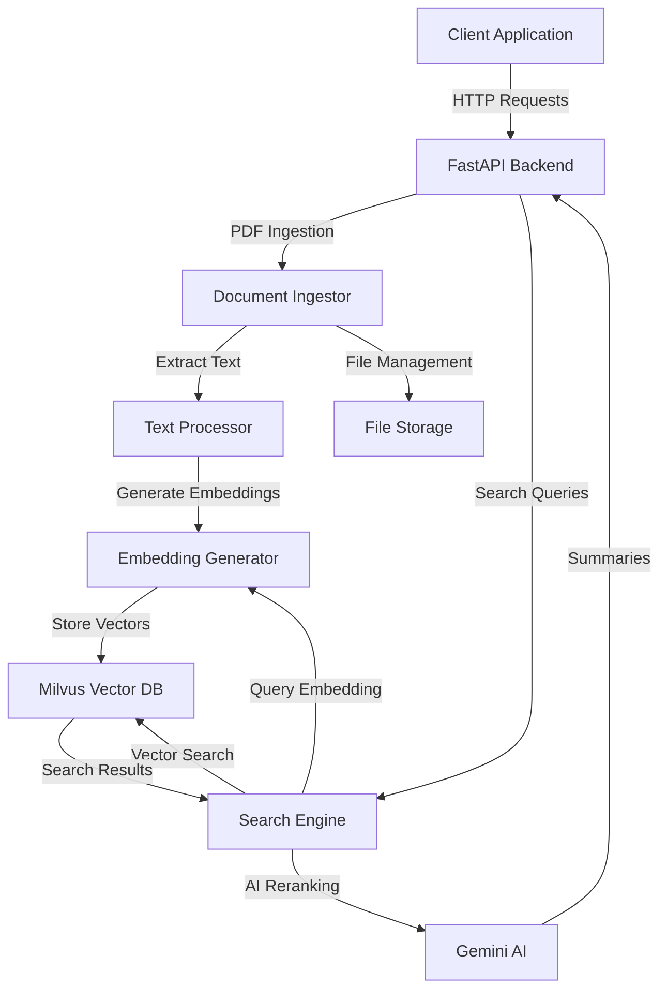

# PDF Reader 2.0 - Detailed Technical Documentation

## Table of Contents
1. [Overview](#overview)
2. [Technical Stack](#technical-stack)
3. [System Architecture](#system-architecture)
4. [Core Components](#core-components)
5. [Data Flow](#data-flow)
6. [API Endpoints](#api-endpoints)
7. [Storage and Vector Search](#storage-and-vector-search)
8. [AI and ML Components](#ai-and-ml-components)
9. [Setup and Configuration](#setup-and-configuration)

## Overview

PDF Reader 2.0 is an advanced document processing and search system that combines modern AI technologies with efficient document handling. The system allows users to ingest PDFs from Google Drive or public URLs, process them for semantic search, and perform both conceptual and keyword-based searches with AI-powered summarization.

## Technical Stack

### Core Technologies
- **Backend Framework**: FastAPI (Python)
- **Vector Database**: Milvus
- **AI/ML Models**:
  - Google's Gemini AI (for embeddings and text generation)
  - BERT-based tokenization
  - Transformer models for text processing
- **PDF Processing**: PyMuPDF
- **Cloud Integration**: Google Drive API
- **Environment Management**: python-dotenv

### Key Dependencies
- **AI/ML**: 
  - google-ai-generativelanguage
  - transformers
  - scikit-learn
- **Data Processing**:
  - numpy
  - pandas
- **API & Web**:
  - FastAPI
  - uvicorn
  - starlette
- **Document Processing**:
  - PyMuPDF
  - python-multipart

## System Architecture



## Core Components

### 1. Document Ingestion System
- **Location**: `ingest/drive_folder_ingest.py`
- **Responsibilities**:
  - Google Drive folder processing
  - Single PDF ingestion
  - Text extraction
  - Chunk management

### 2. Embedding Generator
- **Location**: `embedding/generator.py`
- **Features**:
  - Uses Gemini AI's embedding model
  - Token-based text chunking
  - Parallel embedding generation
  - BERT-based tokenization

### 3. Search Engine
- **Location**: `utils/search_chunks.py`
- **Capabilities**:
  - Vector similarity search
  - Result grouping by document
  - AI-powered reranking
  - Multi-mode search (conceptual/keyword)

## Data Flow

1. **Ingestion Flow**:
   ```
   PDF Document → Text Extraction → Chunking → Embedding Generation → Vector Storage
   ```

2. **Search Flow**:
   ```
   Query → Embedding → Vector Search → Reranking → Grouping → AI Summarization → Response
   ```

## API Endpoints

### 1. PDF Ingestion Endpoints
```python
POST /ingest-drive-folder
POST /ingest-single-public-pdf
```

### 2. Search Endpoint
```python
POST /semantic-search
```
- **Modes**: 
  - Conceptual (default)
  - Keyword-based
- **Returns**: 
  - AI-generated summary
  - Ranked results
  - Source documents

## Storage and Vector Search

### Vector Database (Milvus)
- **Purpose**: Efficient similarity search
- **Features**:
  - High-dimensional vector storage
  - Fast nearest neighbor search
  - Scalable architecture
  - Real-time search capabilities

### Document Storage
- Temporary PDF storage in `temp_pdfs/`
- Vector embeddings in Milvus
- Metadata storage for document tracking

## AI and ML Components

### 1. Embedding Generation
- Model: Gemini AI `models/embedding-001`
- Dimension: 768
- Usage: Document and query embedding

### 2. Text Processing
- Chunking strategy: Token-based with overlap
- Chunk size: 512 tokens
- Overlap: 100 tokens

### 3. AI-Powered Features
- Query understanding
- Result reranking
- Response summarization
- Conceptual matching

## Setup and Configuration

### Environment Variables
Required environment variables:
- `GEMINI_API_KEY`: Google Gemini AI API key
- Other configuration variables as needed

### Installation
```bash
pip install -r requirements.txt
```

### Running the Server
```bash
uvicorn main:app --reload
```

## Performance Considerations

### Optimization Features
1. Parallel embedding generation
2. Efficient chunking strategies
3. Vector search optimization
4. Result caching (where applicable)

### Scalability
- Horizontally scalable architecture
- Modular component design
- Efficient resource utilization

## Security Considerations

1. CORS configuration (currently set for development)
2. API key management
3. Rate limiting (to be implemented)
4. Input validation and sanitization

---

This documentation covers the core technical aspects of the PDF Reader 2.0 system. For specific implementation details, refer to the source code and inline documentation in each module.
